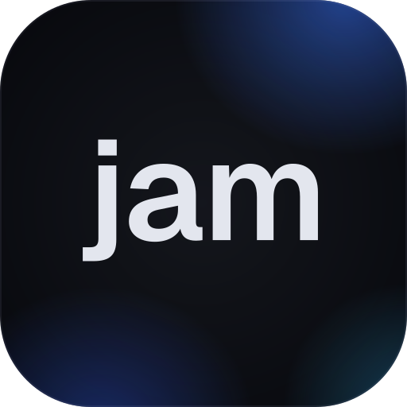

<p align="center">
  
</p>

<h1 align="center">JAM Code</h1>

<p align="center">
  <strong>Use the coding agents you already pay for, in one workspace.</strong>
</p>

<p align="center">
  <a href="https://code.jaym.tech">Website</a> ·
  <a href="https://github.com/jayamartinez/jam-code/releases">Download</a> ·
  <a href="#documentation">Docs</a>
</p>

JAM Code is a free, open-source desktop app that gives coding agents such as
**Claude Code** and **Codex** a proper workspace. Your projects, agent
conversations, Git worktrees, files, terminal, browser and code review sit side
by side in one window, so you can follow and steer an agent's work without
juggling a terminal, an editor and a browser.

To see what it looks like, visit **[code.jaym.tech](https://code.jaym.tech)**
for an interactive preview.

> **Alpha.** v0.1.0-alpha is for technical early adopters. It works, it has
> rough edges, and it may change in incompatible ways.

## What you get

- **Agent chats you can read.** Streaming replies, tool activity and diffs as
  structured cards rather than terminal scrollback. Approve or deny actions and
  answer an agent's questions inline. Stop a turn, pick the model, effort and
  access level, watch context usage, and resume a chat after a restart.
- **Projects and history.** Any folder is a project; Git is optional. Every
  conversation is kept and full-text searchable.
- **Parallel work with worktrees.** Start a chat in the current checkout or in
  a new Git worktree on its own branch, so two chats never edit the same files.
- **Tabs and tiled panes.** Put any chat, terminal, file, browser or review in
  any pane. Closing a pane never stops the work behind it.
- **Terminal.** A real shell beside your chats.
- **Browser.** Preview a local server or any site, annotate elements and
  regions, and attach those annotations to a chat.
- **Files.** A file browser, a syntax-highlighted viewer and rendered Markdown
  preview. File links in an agent's reply open at the right line.
- **Git review.** Status, diffs and stage/unstage for what the agent changed.
- **Make it yours.** Built-in and editor-style themes, imported VS Code
  themes, accents, fonts, backgrounds and customizable keybindings.
- **Snapshots** (macOS). Capture a window straight into a chat's composer.

## Supported agents

| Agent                                                         | Status    |
| ------------------------------------------------------------- | --------- |
| [Claude Code](https://docs.anthropic.com/en/docs/claude-code) | Supported |
| [Codex](https://github.com/openai/codex)                      | Supported |

You need at least one of them installed and signed in. JAM Code works with
either or both. Any other CLI agent still runs as an ordinary command in the
Terminal.

## Platforms

| Platform              | Status                              |
| --------------------- | ----------------------------------- |
| Windows 11 (x64)      | Supported. Windows 10 is untested.  |
| macOS 14+ (universal) | Supported. Intel Macs are untested. |
| Linux                 | Not supported yet.                  |

## Install

1. Download the installer for your platform from
   [Releases](https://github.com/jayamartinez/jam-code/releases). You can check
   it against `SHA256SUMS.txt`.
2. Install and sign in to [Claude Code](https://docs.anthropic.com/en/docs/claude-code)
   (`claude`), [Codex](https://github.com/openai/codex) (`codex`), or both.
3. Open JAM Code and choose **New project…** to add a folder.

Alpha builds are not code-signed yet, so your system asks before the first
launch:

- **Windows:** SmartScreen shows "Windows protected your PC". Choose
  _More info → Run anyway_.
- **macOS:** the app is not notarized. Open it once, then go to _System
  Settings → Privacy & Security_ and choose _Open Anyway_ (on macOS 14,
  right-click the app → _Open_). If macOS says the app is damaged, run
  `xattr -dr com.apple.quarantine "/Applications/JAM Code.app"`.

There is no auto-update yet; new versions are published on the Releases page.

## Provider sign-in and privacy

- JAM Code uses the Claude Code and Codex installations already on your
  machine. It finds them on your `PATH`; Settings → Providers shows what it
  found and lets you point at a different executable.
- Authentication stays with each provider's CLI. JAM Code never asks for,
  reads or stores provider credentials. It shows only the sign-in state and
  plan the CLI reports.
- A chat sends your message, and the context you explicitly attached, to the
  CLI of the agent you chose. Nothing is attached or sent automatically.
- JAM Code has no account and no telemetry. In this alpha, its history and
  settings are stored on your computer.

How each integration works, and what applies to provider plans:
[docs/PROVIDERS.md](docs/PROVIDERS.md).

## Alpha limitations

- Files open read-only in JAM Code; agents make the edits.
- No auto-update, and no import of history created in the providers' own apps.
- The Browser has no devtools and agents cannot control it.
- Snapshots are macOS-only.
- Quitting interrupts running chats; they can be resumed afterwards.
- A conversation shows its latest 500 messages; older ones stay searchable.
- No Linux build.

Found a bug? Use _Help → Report a bug_ in the app, or open an
[issue](https://github.com/jayamartinez/jam-code/issues).

## Build from source

Requirements: Node 22.13+, pnpm 12.6, stable Rust (1.97+) with rustfmt and
clippy, and the [Tauri prerequisites](https://v2.tauri.app/start/prerequisites/)
(MSVC C++ build tools and WebView2 on Windows, Xcode command-line tools on
macOS).

```sh
pnpm install
pnpm desktop        # run the app in development
```

- `JAM_DEMO=1 pnpm desktop` opens a separate demo database with sample
  projects and a scripted demo provider. It never touches your real history.
- `pnpm dev` serves a browser-only preview at `http://127.0.0.1:1420` with
  in-memory sample data and no access to your machine.
- If your pnpm launcher is broken, prefix commands with
  `npm exec --yes --package=pnpm@12.6.0 --`.

Installers and the release process: [docs/RELEASING.md](docs/RELEASING.md).

## Development

```sh
pnpm check        # format, lint, types, tests, production frontend build
pnpm check:rust   # rustfmt, clippy -D warnings, tests
```

| Path                | Responsibility                                                   |
| ------------------- | ---------------------------------------------------------------- |
| `apps/desktop`      | Tauri host: window, tray, native services, transport, Vite entry |
| `packages/client`   | Shared React product UI, semantic design tokens, view state      |
| `packages/protocol` | Platform-neutral types, validation, preview fixtures             |
| `crates/runtime`    | Rust domain: providers, sessions, storage, search, terminal, Git |

### Documentation

- [AGENTS.md](AGENTS.md): working rules for people and coding agents.
- [Architecture](docs/ARCHITECTURE.md): boundaries, ownership and lifecycle.
- [Providers](docs/PROVIDERS.md): how the Claude Code and Codex integrations
  work.
- [Validation](docs/VALIDATION.md): what is tested, on which platforms, and
  what is not.
- [Releasing](docs/RELEASING.md): versions, installers and the release
  checklist.
- [Decision records](docs/adr): why the main architecture decisions were made.

## License

[MIT](LICENSE) © 2026 Jay Martinez. Third-party components and their licenses
are listed in [THIRD_PARTY_NOTICES.md](THIRD_PARTY_NOTICES.md).

Claude Code and Codex are products and trademarks of Anthropic and OpenAI. JAM
Code is an independent project and is not affiliated with either.
