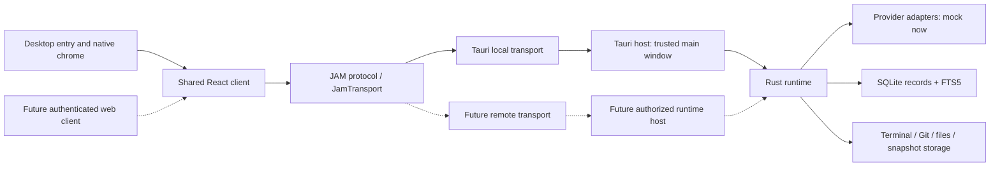
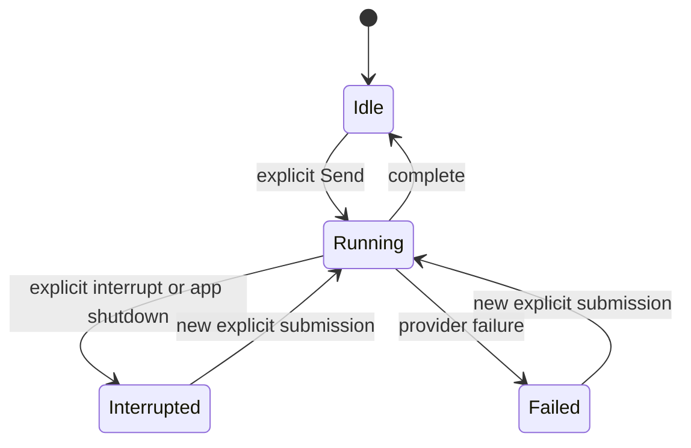

# Architecture

## Decision

Use Tauri 2, React/TypeScript/Vite with pnpm, and a Cargo workspace. Keep a framework-independent Rust runtime and reusable frontend product package. SQLite is the source of truth; FTS5 indexes searchable projections. Start with one runtime crate containing coherent modules rather than separate crates for each noun.



The dashed path is a reserved boundary, not implemented software. No server, WebSocket listener, remote authentication or web application is scaffolded now. The Tauri bridge converts IPC to typed runtime calls and scoped subscriptions. Product components never import Tauri APIs.

## Ownership

| State                                                  | Authority        | Client responsibility                   |
| ------------------------------------------------------ | ---------------- | --------------------------------------- |
| Projects, resource identities, conversations, messages | Runtime / SQLite | Cache and render                        |
| Sessions, in-flight turns, task handles, subscribers   | Runtime          | Render normalized state                 |
| Provider installation/auth/capabilities                | Runtime adapters | Display unknown faithfully              |
| Open views, layout tree, focus, Single/Tiles, drafts   | Client           | Never use view cleanup to stop work     |
| Project files and directory listings                   | Runtime          | Address by project ID and relative path |
| Search index                                           | Runtime storage  | Query and paginate/bound                |
| Appearance settings and wallpaper copy                 | Runtime / SQLite | Apply as tokens; first-paint cache only |
| Native window/menu/tray                                | Desktop host     | Access via injected desktop services    |

Rust protocol models and TypeScript contracts are explicit JSON wire types. Shared fixtures and contract tests catch drift. Keep provider wire types inside adapters. A conversation resource points to a session; future resumptions can add historical sessions without changing resource identity. A view only holds a resource ID.

## Presentation: tabs, panes and the layout tree

A tab is one open resource and owns its own arrangement. A pane is one visible
slot inside the active tab's arrangement:

```
LayoutNode = SplitNode | LeafNode
SplitNode  = { direction: row | column, ratio, first, second }
LeafNode   = { paneId, resourceId | null }
```

Selecting a tab switches the whole workspace to that tab's tree. It never loads
a resource into whichever pane happens to be focused, which is the distinction
between navigating and arranging. Panes are therefore local to the tab you are
in rather than app-wide: a terminal, file or review opened beside a
conversation belongs to that conversation's workspace and does not appear in
the tab bar. The `+` in the tab bar opens a new tab; an empty pane's own
control and the pane menu fill that pane.

A leaf holds a resource ID and nothing else, so the layout never learns whether
it is arranging a conversation, a terminal, a file, a file browser or a review;
any resource can occupy any leaf and there are no per-kind split types. An
empty leaf is a real state: splitting creates a pane before its resource is
chosen. A boundary test fails if layout code starts naming resource kinds.

Single presents the tab's own resource; Tiles presents its tree. Switching
between them changes nothing else: every tab's tree survives the round trip,
and so do resource identities and sessions. Closing a pane removes a slot;
closing a tab discards that tab's arrangement. Neither ends a session — only an
explicit lifecycle command does.

Resource identity for non-conversation resources belongs to the runtime.
`resource.open` is keyed by project, kind and path, so reopening the same file
returns the record that already exists instead of duplicating it.

A conversation's open or closed state is runtime data on its resource:
`closedAt` and `closeSuggestionDismissedAt`. `thread.setClosed` and
`thread.keepOpen` change them only on an explicit request, and `turn.start`
clears `closedAt`, so continuing a thread reopens it. When to suggest closing
is a client preference computed from those timestamps; no timer runs.
`project.update` also accepts `pinned`.

## Project files

`directory.list` resolves exactly one directory level, `file.read` returns one
file and `file.write` saves a working copy, all addressed by project ID and a
project-relative path that the runtime validates and resolves. A client never submits a local path. The wire
shape is therefore already the lazily expanded tree a large repository needs.

Projects without configured folders serve an isolated demo tree from
`packages/protocol/fixtures/files.json`, shared by the Rust runtime and the
browser development preview so they cannot drift. Those listings and files are flagged `demo`. Configured projects open bounded, read-only native files from Review through the same File resource APIs; native directory browsing and writes remain deferred (ADR 0010). Saves do not mutate that fixture: a working copy is recorded
in the `file_edits` table and layered over the fixture on read, so an edit
survives restart while the shipped tree stays pristine. The scoped native reader uses the same protocol and client; a future folder picker and remote host must establish their own access grants.

Directory listings and expansion state are client-owned and live outside any
mounted pane, because reshaping the layout remounts panes and a repository tree
must not collapse when a file opens beside it.

## Transport and consistency

`JamTransport.request(method, params)` returns typed results; `subscribe(scope, listener)` returns an async disposable subscription. Local streaming uses scoped Tauri Channels, not a frontend-wide broadcast of every token. Protocol version, runtime epoch and monotonic sequence identify events. Register before reading a snapshot, buffer events while the read is in flight, then apply only events after its cursor. Duplicate message updates replace by message ID. On epoch change/gap/disconnect, fetch a fresh authoritative snapshot instead of replaying a guessed state. The first client may use invalidation/refetch for bounded conversations; this is not a high-volume token strategy.

Send commands carry a client-generated request ID. The runtime rejects conflicting in-flight work and deduplicates retried submissions; it must not double-run a turn after an acknowledgement is lost. An accepted receipt is separate from completion. Cancel/interrupt is distinct from closing, deleting history or rolling back files. Errors use stable codes and useful messages; unknown methods/versions fail before mutation.

Commit accepted input and normalized updates before publishing events. Never hold a storage lock across provider waits or UI delivery. On restart, running records become interrupted; a dead process is not reported as live. Real provider adapters will require version-specific reconciliation.

## Lifecycle



The initial runtime lives in the Tauri core process, outside WebView and React lifetimes. The desktop single-instance guard runs before database setup: a second launch reopens the existing app instead of recovering its still-active sessions. Closing any pane detaches only presentation. Hiding/closing the main window keeps the process alive only when a working tray/reopen path exists. Tray Show reopens it; explicit Quit records interruptions and stops owned tasks under one two-second shutdown deadline before exit. Reloading or destroying the main WebView detaches its subscriptions without stopping sessions. macOS Dock/menu reopening is host behavior. A crash, application exit or OS shutdown does not preserve processes. Durable transcripts survive restart. There is no promise of daemon-level survival.

If unattended jobs or remote access require survival beyond application lifetime, add a separate runtime executable and authenticated transport. The runtime crate already accepts callers without Tauri and owns its services; avoid adding a daemon until that requirement is real. Before adding another host, establish process-level database ownership: the current core assumes the desktop host has already enforced single ownership and must not be opened concurrently by independent runtime processes.

## Storage and search

Runtime modules own numbered transactional migrations, foreign keys and FTS5. Use WAL for the local file database and bounded busy waits. Seed demo data explicitly and idempotently. Keep application data outside the repository. Persist source records and search documents in the same transaction. Tokenize plain user input safely; never interpolate it as SQL or accept unrestricted FTS operators. Results use text snippets, not trusted HTML. Cap search query length and results. Initial search semantics are token/prefix matching, not arbitrary substring matching.

Persistent product settings live in the `settings` table, one validated JSON record per key; appearance and its wallpaper copy are separate keys so saving a font size never rewrites image data. Ephemeral view state (layout, Markdown Preview/Source, drafts) stays in the client. Schema evolution must keep stable resource/message IDs, include migration failure reporting and prohibit destructive resets as a migration strategy. Backups and retention policy precede real user data import. Do not log complete transcripts by default.

### Foundation bounds

The isolated `jam-demo.sqlite` database preserves all recorded messages. A conversation read returns its latest 500 messages; older rows remain searchable, but transcript pagination is not implemented. Search returns at most 50 distinct conversations, ranked before applying that limit; a blank or punctuation-only query returns no results. Native FTS search uses plain token/prefix matching. These constraints must be revisited before importing real provider history.

Each subscription has a 256-event FIFO and one coalesced latest event. When a slow client overflows that FIFO, the latest cursor is still delivered after buffered events: skipped sequences trigger the client's authoritative reread, including when the skipped update was the end of a turn. At most 128 subscriptions can coexist. The host clears old subscriptions at page reload and window destruction. The current shared client uses a workspace subscription; resource-scoped subscriptions are available for later scaling. A gap in a resource-scoped global sequence can also reflect activity in another resource, so a conservative reread is safe rather than evidence of data loss.

Request limits match the TypeScript contract in UTF-16 units: identifiers 128, prompt text 20,000, 16 context items, and search queries 256. Context-only sends are allowed, but the mock adapter never resolves assets or reads their source URIs. Most draft context is client-owned until explicit Send. Snapshots are an exception: their staged metadata and assets survive restart in runtime-owned app data. Sending atomically commits the canonical context with the turn receipt and retains the asset with history. The mock provider does not inspect image contents or call a model. Machine access is limited to explicit terminal shells, project-scoped Git CLI commands, bounded file reads and user-triggered snapshot capture by the desktop host.

## Native services and platform differences

- Terminal: runtime-owned PTYs (`portable-pty`), a bounded replay buffer, resize/attach/detach and acknowledged flow control, with xterm loaded only by a mounted terminal pane. Output streams per attachment, outside workspace events. Process exit is never coupled to component unmount. See ADR 0006.
- Editor: CodeMirror 6, loaded only by a File pane that is actually rendered, with language modes in per-language chunks chosen from the runtime's file-name language (see DESIGN.md → Code). Markdown files render in a lazily loaded preview built from markdown-it tokens without an HTML string (ADR 0008). Merely opening a file resource, or leaving one open in a hidden tab, constructs no editor. Writing still needs a filesystem service and explicit save conflicts, so the File resource is read-only and says so.
- Git: runtime-owned `GitManager`, user's installed CLI and typed `git.status`, `git.diff`, `git.setStaged` requests. Porcelain v2 status, lazy structured patches and explicit file staging; focus/activation/manual refresh with no idle polling. See [ADR 0010](adr/0010-git-review.md) for bounds, scope and safety.
- Browser: one native child webview per Browser resource (WKWebView / WebView2), owned by the desktop host and placed over its pane; see [ADR 0007](adr/0007-native-browser.md). Pages are unprivileged: they match no capability, have no page-to-host channel, may only load http(s), and keep cookies in a profile separate from JAM's interface. WebView2 and WKWebView differ; devtools/automation parity is not promised.
- Terminal and Browser deliberately have different owners. A shell is a machine capability, so the runtime owns it and a client (local now, remote later) drives it through `JamTransport`. A native webview is a piece of the local window, so the desktop host owns it and the shared client reaches it only through the optional `DesktopServices.browser`; a remote client would present browsing differently. Both follow the same view rules: a pane attaches and detaches, only an explicit command ends the shell or page, and a reload of JAM's own webview detaches both without ending either.
- Snapshots: runtime-owned `SnapshotManager` stores metadata, settings and JPEG assets; the desktop host owns the shortcut listener (a modifier-state sampler for both Shift keys or a system hotkey; neither needs Input Monitoring), the Screen Recording check, one-shot platform capture and nonactivating feedback. Last-focused conversation is explicit runtime metadata, independent of file/terminal focus. See [ADR 0009](adr/0009-snapshots.md).
- Context: typed provenance/selection and opaque asset references. Snapshots reuse `ContextItem.kind = snapshot`; no binary payload lives in the workspace state. Capturing stages context and never invokes Send. Remote clients cannot submit arbitrary local paths as capability grants.
- Windows uses right-side native-style controls; macOS uses left-side traffic lights and Cmd shortcuts. Host supplies the platform and window actions. Titlebar drag areas exclude interactive controls.

## Trust boundaries

General Tauri permissions are restricted to local main UI; the local Snapshot toast has a separate narrow allowlist without turn submission. Main capabilities are scoped to the `main` _webview_ rather than the window, because Browser pages are child webviews of that window. Declare application IPC commands through `AppManifest::commands` so capabilities actually gate them. Validate the envelope and per-command inputs in Rust. No generic shell/filesystem plugin capability, remote URLs, external scripts or provider credentials in the frontend. Content security policy permits bundled resources and native IPC; development-server allowances stay development-only. Render agent content as text/structured blocks; raw HTML is not trusted. Repository Markdown is rendered as allow-listed React elements with raw HTML disabled; its links open only in-document anchors, project files or a Browser resource, never JAM's own window (ADR 0008).

A future remote host needs explicit pairing, transport encryption, revocable device credentials, per-project authorization, origin checking, CSRF/replay protection, rate/resource limits, audit and reconnection semantics. Authentication alone is not authorization to execute local commands. Remote clients receive opaque project/asset IDs; the runtime resolves paths. These are requirements, not implemented claims.

## Performance and risks

No idle polling or eager agent processes. The one exception is the both-Shift-keys Snapshot shortcut, which samples modifier state every 50 ms while Snapshots is on (ADR 0009). Scope subscriptions, batch normalized updates, bound queries and lazily render expensive surfaces. Transcript pagination/virtualization is required before importing large histories; the foundation uses small bounded demo records. Measure native process plus WebView child memory, not only one executable. Establish startup marks from client bootstrap to workspace loaded, FTS query timings and release startup/RSS/idle CPU procedures in `docs/VALIDATION.md`.

The largest uncertainties are provider subscription eligibility, changing provider protocols, WebView browser automation parity, modifier-only global capture, platform-specific background lifetime, and remote authorization. None require an Electron fallback now.
