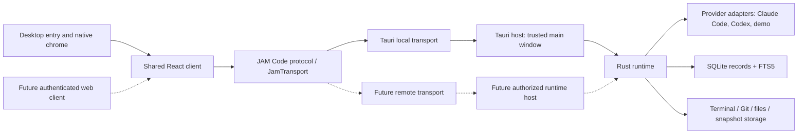
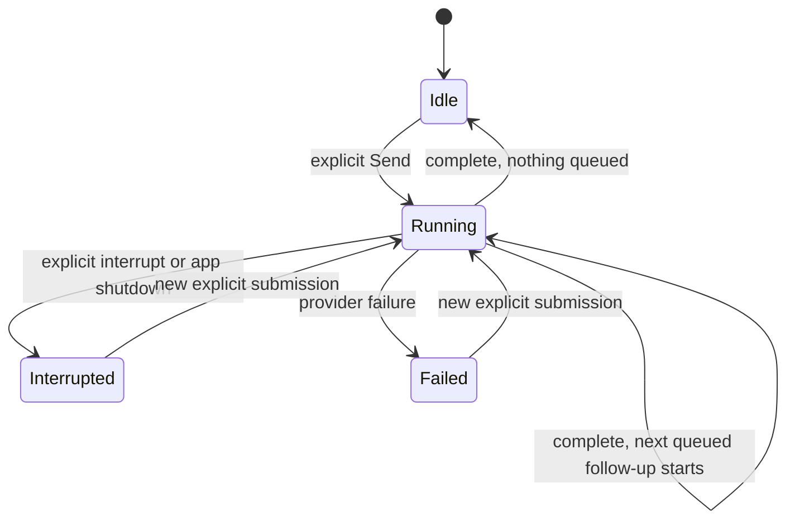

# Architecture

## Decision

Use Tauri 2, React/TypeScript/Vite with pnpm, and a Cargo workspace. Keep a framework-independent Rust runtime and reusable frontend product package. SQLite is the source of truth; FTS5 indexes searchable projections. One runtime crate contains coherent modules rather than a separate crate for each noun.



The dashed path is a reserved boundary, not implemented software. No server, WebSocket listener, remote authentication or web application is scaffolded now. The Tauri bridge converts IPC to typed runtime calls and scoped subscriptions. Product components never import Tauri APIs.

## Domain language

| Concept          | Meaning                                                                                           | Lifetime                      |
| ---------------- | ------------------------------------------------------------------------------------------------- | ----------------------------- |
| Project          | A folder (or several) on a machine, with a name and icon; Git is optional                         | Durable                       |
| Resource         | Addressable conversation, terminal, browser, file, file browser, review or Settings               | Independent of presentation   |
| View             | One visible presentation of a resource                                                            | Client-owned                  |
| Layout           | Tabs, each tab's split tree of views, Single/Tiles and focus                                      | Client-owned presentation     |
| Conversation     | Searchable transcript and context history                                                         | Durable                       |
| Agent session    | Runtime-owned execution state and the provider's session reference                                | Independent of views          |
| Turn             | One explicit user submission and the agent activity that follows                                  | Durable outcome               |
| Queued follow-up | A submission sent while the agent works, waiting to become the next turn                          | Durable until sent or removed |
| Context item     | A file, selection, diff, browser annotation, terminal excerpt, message, snapshot or attached file | Staged, then explicitly sent  |

Visible and focused are different states, and closing a view leaves its resource available in history. A terminal is a resource with a real PTY, never the rendering mechanism for conversations.

## Ownership

| State                                                  | Authority        | Client responsibility                   |
| ------------------------------------------------------ | ---------------- | --------------------------------------- |
| Projects, resource identities, conversations, messages | Runtime / SQLite | Cache and render                        |
| Choosing a project folder (native picker)              | Desktop host     | `DesktopServices.pickDirectory`         |
| Choosing files to attach (native picker)               | Desktop host     | `DesktopServices.attachFiles`           |
| Attached files: copies, metadata, lifetime             | Runtime / files  | Address by attachment ID, never a path  |
| Sessions, in-flight turns, task handles, subscribers   | Runtime          | Render normalized state                 |
| Queued follow-ups, their order and owned assets        | Runtime / SQLite | Render `queue.updated`; never reorder   |
| Provider installation/auth/capabilities                | Runtime adapters | Display unknown faithfully              |
| Provider processes, pending approvals/questions        | Runtime adapters | Answer by JAM Code interaction ID       |
| Provider session/thread IDs (`provider_bindings`)      | Runtime / SQLite | Never sees them                         |
| Provider history index                                 | Runtime / SQLite | Address entries by history ID           |
| Open views, layout tree, focus, Single/Tiles, drafts   | Client           | Never use view cleanup to stop work     |
| Project files and directory listings                   | Runtime          | Address by project ID and relative path |
| Worktrees JAM Code created (`worktrees`)               | Runtime / SQLite | Address by worktree ID, never by path   |
| Search index                                           | Runtime storage  | Query and paginate/bound                |
| Appearance settings and wallpaper copy                 | Runtime / SQLite | Apply as tokens; first-paint cache only |
| Native window/menu/tray                                | Desktop host     | Access via injected desktop services    |

Rust protocol models and TypeScript contracts are explicit JSON wire types. Shared fixtures and contract tests catch drift. Keep provider wire types inside adapters. A conversation resource points to a session; future resumptions can add historical sessions without changing resource identity. A view only holds a resource ID.

## Presentation: tabs, panes and the layout tree

A tab is one open resource and owns its own arrangement. A pane is one visible
slot inside the active tab's arrangement:

```
LayoutNode = SplitNode | LeafNode
SplitNode  = { direction: row | column, ratio, first, second }
LeafNode   = { paneId, resourceId | null }
```

Selecting a tab switches the whole workspace to that tab's tree. It never loads
a resource into whichever pane happens to be focused, which is the distinction
between navigating and arranging. Panes are therefore local to the tab you are
in rather than app-wide: a terminal, file or review opened beside a
conversation belongs to that conversation's workspace and does not appear in
the tab bar. The `+` in the tab bar opens a new tab; an empty pane's own
control and the pane menu fill that pane.

A leaf holds a resource ID and nothing else, so the layout never learns whether
it is arranging a conversation, a terminal, a file, a file browser or a review;
any resource can occupy any leaf and there are no per-kind split types. An
empty leaf is a real state: splitting creates a pane before its resource is
chosen. A boundary test fails if layout code starts naming resource kinds.

Single presents the tab's own resource; Tiles presents its tree. Switching
between them changes nothing else: every tab's tree survives the round trip,
and so do resource identities and sessions. Closing a pane removes a slot;
closing a tab discards that tab's arrangement. Neither ends a session — only an
explicit lifecycle command does.

Resource identity for non-conversation resources belongs to the runtime.
`resource.open` is keyed by project, kind and path, so reopening the same file
returns the record that already exists instead of duplicating it.

Archiving a conversation is runtime data on its resource: `closedAt` (the
field keeps its earlier name; the interface says Archived) and
`closeSuggestionDismissedAt`. `thread.setClosed` and `thread.keepOpen` change
them only on an explicit request, and `turn.start` clears `closedAt`, so
continuing a thread reopens it. Archiving changes nothing else: the transcript,
session, provider binding, worktree and pin stay, and it is refused while the
agent is working or waiting for an answer, because it never stops one. Clients
leave archived conversations out of Recent and Pinned and list them under their
project; search still finds them. When to suggest archiving is a client
preference computed from those timestamps; no timer runs. `thread.setPinned`
pins or unpins a conversation, and `project.update` accepts `pinned` for a
project.

The sidebar's arrangement is runtime data too, so it survives a restart and is
the same in every view. `sidebar.reorder` stores the order of its sections
(Projects, Pinned, History), each listed exactly once, and `workspace.get`
returns it as `sidebarSections`; absent means the default order.
`project.reorder` stores the order of projects, which `workspace.get` then
returns them in; a project added afterward follows the arranged ones. That
order is bounded at 500 identifiers and names each project once.

Chats are never arranged by hand. Every chat list is an inbox sorted by the
resource's `updatedAt`, newest first, and the runtime sets it whenever a chat
is used (a turn is sent or stopped), finishes or fails, or begins waiting for
an answer. A client rereads the resources on those events; nothing polls.

Deleting a conversation (`conversation.delete`) is a separate, permanent
lifecycle command, asked for through a confirmation. In one transaction the
runtime removes what only that conversation owns: its resource, conversation
and session rows, messages, search documents (and with them its FTS entries),
provider binding, request receipts and the snapshots and attachments sent in
it; a snapshot
still staged for it returns to the inbox. It never touches the project's
folder or files, Git branches or worktrees (the `worktrees` record stays), the
provider's own history, or any other conversation; a provider-history entry
linked to it stays in the index, unlinked (ADR 0016). It is refused while the
agent is working, waiting for an answer or still stopping an interrupted turn,
so the database never changes under a live provider task, and a conversation
that is already gone is `not_found`, which a retrying client treats as done.
Afterwards the adapter releases any process it kept for that session. The
client then drops every view of it: its tabs, its panes in other tabs and its
entries in the reopen-closed-tab history, so nothing can bring it back.

Menus anchored to a control (the composer's pickers, every `MenuSelect`, the
project and branch pickers, Help) render into one overlay host at the end of
the document and are positioned from their trigger's rectangle in the window.
A pane or the sidebar may carry a backdrop filter, which makes it the
containing block and stacking context for anything fixed inside it, so a menu
is never drawn inside the surface that opens it. A menu opened from a modal
dialog uses a host inside that dialog, since the rest of the document is inert.
Any open menu hides native Browser pages, like dialogs and the launcher do.

## Project files

`directory.list` resolves exactly one directory level, `file.read` returns one
file and `file.write` saves a working copy, all addressed by project ID and a
project-relative path that the runtime validates and resolves. A client never submits a local path. The wire
shape is therefore already the lazily expanded tree a large repository needs.

A project's first folder (or a chat's worktree) is listed natively one level at a time, read-only and bounded to 500 entries, without `.git`, symlinks or junctions, and its files open read-only through the same File resource APIs; writes remain deferred (ADR 0010, ADR 0013). Projects without folders exist only in demo data and serve an isolated demo tree from
`packages/protocol/fixtures/files.json`, shared by the Rust runtime and the
browser development preview so they cannot drift. Those listings and files are flagged `demo`. Saves do not mutate that fixture: a working copy is recorded
in the `file_edits` table and layered over the fixture on read. Folders enter the runtime only through `project.create`/`project.update`, normally with a path the desktop host's native folder picker returned; a future remote host must establish its own access grants.

Directory listings and expansion state are client-owned and live outside any
mounted pane, because reshaping the layout remounts panes and a repository tree
must not collapse when a file opens beside it.

## Transport and consistency

`JamTransport.request(method, params)` returns typed results; `subscribe(scope, listener)` returns an async disposable subscription. Local streaming uses scoped Tauri Channels, not a frontend-wide broadcast of every token. Protocol version, runtime epoch and monotonic sequence identify events. Register before reading a snapshot, buffer events while the read is in flight, then apply only events after its cursor. Duplicate message updates replace by message ID. On epoch change/gap/disconnect, fetch a fresh authoritative snapshot instead of replaying a guessed state. The first client may use invalidation/refetch for bounded conversations; this is not a high-volume token strategy.

Send commands carry a client-generated request ID. The runtime rejects conflicting in-flight work and deduplicates retried submissions; it must not double-run a turn after an acknowledgement is lost. An accepted receipt is separate from completion. Cancel/interrupt is distinct from closing, deleting history or rolling back files. Errors use stable codes and useful messages; unknown methods/versions fail before mutation.

Commit accepted input and normalized updates before publishing events. Never hold a storage lock across provider waits or UI delivery. On restart, running records become interrupted and unanswered provider requests expire; a dead process is not reported as live. Queued follow-ups survive a restart and wait; none starts at launch. Provider adapters reconcile streamed deltas with authoritative items and record the CLI version they were tested with.

## Lifecycle



### Queued follow-ups

A message sent while the agent works can wait as a queued follow-up (ADR 0015). It is runtime state in `queued_turns`: text, context and the chat's options captured when it was queued, an explicit `position`, its creation time and any reason it could not be sent. `queue.add` is deduplicated by request ID like `turn.start`; `queue.update`, `queue.move`, `queue.remove` and `queue.send` change it, and every change publishes the conversation's whole queue as `queue.updated`. `conversation.get` returns it as `queued`. It is not a message or a search document until it is sent. At most 20 wait per conversation.

Dispatch keeps one provider turn per session. A turn that finishes `completed` while a follow-up waits (and the first has not failed) leaves the session `running`; once its task has ended the runtime starts the first follow-up as a turn whose request ID is the follow-up's ID, removing it from the queue in the same transaction. The chat never reports finishing in between, so attention and notifications see one continuous run. A pending approval holds the queue (the turn has not finished); a failure, an interrupt, Stop during the handoff, a follow-up that could not start and a restart leave it waiting for the reader, who can send one now. JAM never starts agent work at launch.

A follow-up owns the staged snapshots and attachments it carries (`queued_id`): staged expiry, the start-up cleanup, the snapshot inbox and retention skip them, and nothing else can send or remove them. Sending moves them into the conversation exactly as a Send does; removing the follow-up deletes its attachments' copies and returns its snapshots to the inbox. Deleting a conversation removes its queue the same way.

The initial runtime lives in the Tauri core process, outside WebView and React lifetimes. The desktop single-instance guard runs before database setup: a second launch reopens the existing app instead of recovering its still-active sessions. Closing any pane detaches only presentation. Hiding/closing the main window keeps the process alive only when a working tray/reopen path exists. Tray Show reopens it; explicit Quit records interruptions and stops owned tasks under one two-second shutdown deadline before exit. Reloading or destroying the main WebView detaches its subscriptions without stopping sessions. macOS Dock/menu reopening is host behavior. A crash, application exit or OS shutdown does not preserve processes. Durable transcripts survive restart. There is no promise of daemon-level survival.

If unattended jobs or remote access require survival beyond application lifetime, add a separate runtime executable and authenticated transport. The runtime crate already accepts callers without Tauri and owns its services; avoid adding a daemon until that requirement is real. Before adding another host, establish process-level database ownership: the current core assumes the desktop host has already enforced single ownership and must not be opened concurrently by independent runtime processes.

## Storage and search

Runtime modules own numbered transactional migrations, foreign keys and FTS5. Use WAL for the local file database and bounded busy waits. Before migrating an existing database the runtime writes `<name>.before-v<N>.bak` beside it, and it refuses a database from a newer schema without touching it. Seed demo data only in an explicit demo database (ADR 0013). Keep application data outside the repository. Persist source records and search documents in the same transaction. Tokenize plain user input safely; never interpolate it as SQL or accept unrestricted FTS operators. Results use text snippets, not trusted HTML. Cap search query length and results. Initial search semantics are token/prefix matching, not arbitrary substring matching.

Persistent product settings live in the `settings` table, one validated JSON record per key; appearance and its wallpaper copy are separate keys so saving a font size never rewrites image data. Ephemeral view state (layout, Markdown Preview/Source, drafts) stays in the client. Schema evolution must keep stable resource/message IDs, include migration failure reporting and prohibit destructive resets as a migration strategy. Backups and retention policy precede real user data import. Do not log complete transcripts by default.

### Current bounds

The user database, `jam.sqlite` in the platform application-data folder, preserves all recorded messages; it has no demo seed, and `JAM_DEMO=1` opens a separate `demo/demo.sqlite` instead (ADR 0013). A conversation read returns its latest 500 messages; older rows remain searchable, but transcript pagination is not implemented. Search returns at most 50 distinct conversations, ranked before applying that limit; a blank or punctuation-only query returns no results. Native FTS search uses plain token/prefix matching. These constraints must be revisited before syncing real provider history (ADR 0016); a scan indexes metadata only and adds nothing to search, and `providerHistory.list` returns at most 200 entries a page.

Each subscription has a 256-event FIFO and one coalesced latest event. When a slow client overflows that FIFO, the latest cursor is still delivered after buffered events: skipped sequences trigger the client's authoritative reread, including when the skipped update was the end of a turn. At most 128 subscriptions can coexist. The host clears old subscriptions at page reload and window destruction. The current shared client uses a workspace subscription; resource-scoped subscriptions are available for later scaling. A gap in a resource-scoped global sequence can also reflect activity in another resource, so a conservative reread is safe rather than evidence of data loss.

Request limits match the TypeScript contract in UTF-16 units: identifiers 128, prompt text 20,000, 16 context items, and search queries 256. Context-only sends are allowed. On Send the runtime resolves snapshot assets it owns into images for the provider and composes other context as text with its provenance; it never reads arbitrary source URIs. Most draft context is client-owned until explicit Send. Snapshots are an exception: their staged metadata and assets survive restart in runtime-owned app data. Sending atomically commits the canonical context with the turn receipt and retains the asset with history. Attached files follow the same rule with a shorter staging life (ADR 0014): the desktop host's file chooser hands each chosen file to the runtime (a paste hands over the pasted bytes instead), which copies it unchanged into its own `attachments` folder under an opaque ID; the original is not read again and its location is not recorded. Any file type can be attached, because delivery does not depend on a provider's protocol: every agent is given the path of the copy in the turn's text and opens it with its own tools, and an adapter may additionally send what its provider takes natively (images today). A staged copy is removed with its chip, after 24 hours or at the next start. A sent one moves into its conversation's own folder, the only attachment folder that conversation's agent is pointed at, and goes only when the conversation is deleted. Limits: 16 files per pick, files to 25 MB, native images to 5 MB each and 12 MB per Send, 100 MB of attachments per Send. The demo provider does not inspect image contents or call a model; a real provider receives a snapshot image only if its model reports image support. Machine access is limited to explicit terminal shells, project-scoped Git CLI commands, bounded file reads and user-triggered snapshot capture by the desktop host.

## Providers

The runtime's `ProviderManager` holds the adapters (Claude Code, Codex, demo), the saved provider settings and the last check. Checks run on first need, never at launch and never on a timer. A turn is a runtime task that drives the adapter's future; the adapter owns its processes, speaks its provider's wire protocol, and reports normalized blocks, interactions, model, usage and the provider's own session ID. Approvals and questions wait in a runtime broker keyed by JAM Code interaction ID. Interrupting asks the provider to stop the turn and lets it settle (bounded) before another turn starts; processes end on Quit or after 15 idle minutes and resume by provider ID. See [PROVIDERS.md](PROVIDERS.md) and [ADR 0011](adr/0011-live-providers.md).

Provider history is the provider's own record of its conversations, including ones made outside JAM Code, and stays canonical. The runtime's history service (`crates/runtime/src/history`) asks an adapter's `ProviderHistory` to list it into an index (`provider_history`, one row per provider, instance and native ID), on request, never at launch or on a timer, and never holding the database lock while the provider answers. A provider's reported folder links an entry only to a project or worktree JAM already has; it never creates a project or grants access. See [ADR 0016](adr/0016-provider-history.md).

## Native services and platform differences

- Terminal: runtime-owned PTYs (`portable-pty`), a bounded replay buffer, resize/attach/detach and acknowledged flow control, with xterm loaded only by a mounted terminal pane. Output streams per attachment, outside workspace events. Process exit is never coupled to component unmount. See ADR 0006.
- Editor: CodeMirror 6, loaded only by a File pane that is actually rendered, with language modes in per-language chunks chosen from the runtime's file-name language (`language_for`). Markdown files render in a lazily loaded preview built from markdown-it tokens without an HTML string (ADR 0008). Merely opening a file resource, or leaving one open in a hidden tab, constructs no editor. Writing still needs a filesystem service and explicit save conflicts, so the File resource is read-only and says so.
- Git: runtime-owned `GitManager`, user's installed CLI and typed `git.status`, `git.branches`, `git.diff`, `git.setStaged` requests. Porcelain v2 status, lazy structured patches and explicit file staging; focus/activation/manual refresh with no idle polling. See [ADR 0010](adr/0010-git-review.md) for bounds, scope and safety.
- New chat workspaces: a new chat's first Send may switch the project's checkout to another branch (as `git switch` does: uncommitted changes come along and Git refuses rather than overwrite one), join the worktree that already has a branch checked out, or create a worktree with its own `jam/<name>` branch and folder. Chats share a checkout, and a started chat can change where it works from its next Send (`conversation.workspace`). Worktrees are runtime records; the chat and the Review, files and terminals opened from it carry a `worktreeId`, and the runtime resolves and verifies the folder on every use. JAM Code never deletes or resets a worktree or branch. See [ADR 0012](adr/0012-new-chat-worktrees.md).
- Browser: one native child webview per Browser resource (WKWebView / WebView2), owned by the desktop host and placed over its pane; see [ADR 0007](adr/0007-native-browser.md). Pages are unprivileged: they match no capability, have no page-to-host channel, may only load http(s), and keep cookies in a profile separate from JAM Code's interface. WebView2 and WKWebView differ; devtools/automation parity is not promised.
- Terminal and Browser deliberately have different owners. A shell is a machine capability, so the runtime owns it and a client (local now, remote later) drives it through `JamTransport`. A native webview is a piece of the local window, so the desktop host owns it and the shared client reaches it only through the optional `DesktopServices.browser`; a remote client would present browsing differently. Both follow the same view rules: a pane attaches and detaches, only an explicit command ends the shell or page, and a reload of JAM Code's own webview detaches both without ending either.
- Snapshots: runtime-owned `SnapshotManager` stores metadata, settings and JPEG assets; the desktop host owns the shortcut listener (a modifier-state sampler for both Shift keys or a system hotkey; neither needs Input Monitoring), the Screen Recording check, one-shot platform capture and nonactivating feedback. Last-focused conversation is explicit runtime metadata, independent of file/terminal focus. See [ADR 0009](adr/0009-snapshots.md).
- Context: typed provenance/selection and opaque asset references. Snapshots reuse `ContextItem.kind = snapshot` and attached files `kind = attachment`; no binary payload lives in the workspace state. Capturing stages context and never invokes Send. Remote clients cannot submit arbitrary local paths as capability grants.
- Windows uses right-side native-style controls; macOS uses left-side traffic lights and Cmd shortcuts. Host supplies the platform and window actions. Titlebar drag areas exclude interactive controls.

## Trust boundaries

General Tauri permissions are restricted to local main UI; the local Snapshot toast has a separate narrow allowlist without turn submission. Main capabilities are scoped to the `main` _webview_ rather than the window, because Browser pages are child webviews of that window. Declare application IPC commands through `AppManifest::commands` so capabilities actually gate them. Validate the envelope and per-command inputs in Rust. No generic shell/filesystem plugin capability, remote URLs, external scripts or provider credentials in the frontend. Content security policy permits bundled resources and native IPC, and one kind of frame: a `blob:` the interface makes for an attached PDF (ADR 0014); development-server allowances stay development-only. Render agent content as text/structured blocks; raw HTML is not trusted. Repository Markdown is rendered as allow-listed React elements with raw HTML disabled; its links open only in-document anchors, project files or a Browser resource, never JAM Code's own window (ADR 0008).

A future remote host needs explicit pairing, transport encryption, revocable device credentials, per-project authorization, origin checking, CSRF/replay protection, rate/resource limits, audit and reconnection semantics. Authentication alone is not authorization to execute local commands. Remote clients receive opaque project/asset IDs; the runtime resolves paths. These are requirements, not implemented claims.

## Performance and risks

No idle polling or eager agent processes. The one exception is the both-Shift-keys Snapshot shortcut, which samples modifier state every 50 ms while Snapshots is on (ADR 0009). Scope subscriptions, batch normalized updates, bound queries and lazily render expensive surfaces. Transcript pagination/virtualization is required before importing large histories. Measure native process plus WebView child memory, not only one executable. Establish startup marks from client bootstrap to workspace loaded, FTS query timings and release startup/RSS/idle CPU procedures in `docs/VALIDATION.md`.

The largest uncertainties are provider subscription eligibility, changing provider protocols, WebView browser automation parity, modifier-only global capture, platform-specific background lifetime, and remote authorization. None require an Electron fallback now.
